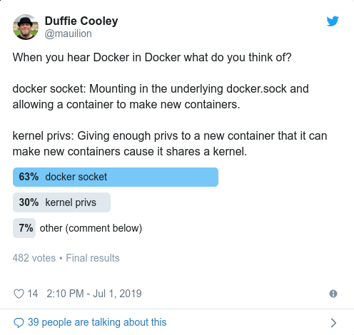

### DIND Proof of concept.

The goal of this image is to provide the tooling necessary to work through a couple of exercises that highlight what Docker in Docker means.

There are two definitions that are both viable.

See this twitter poll for a little more color around which of the two folks assume is relevant.


to deploy this container on a node you can run:

```
docker run -ti -v /var/run/docker.sock:/var/run/docker.sock --pid=host --privileged quay.io/mauilion/dind:master bash
```

to deploy this as a pod on a Kubernetes cluster

you can deploy this manifest with:

kubectl apply -f https://git.io/dind-pod.yaml
